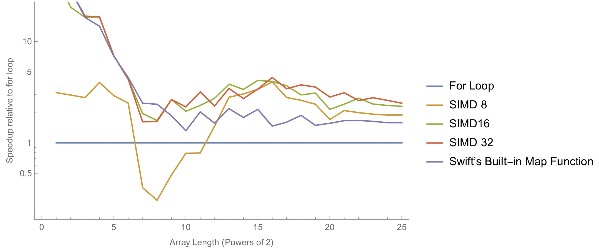

# Swift-Data-Structures
This project aims to provide a variety of enhancements (both features and performance) to the existing data structures in Swift. Thep purpose of these improvements is to let Swift become more powerful in computations.

### Array Operations
This category of improvements are extensions to the existing Swift arrays. Many of these are inspired by the NumPy library for python.

- Scalar multiplication

  ```swift
    let A = [0.3, -2.5, 4.0, 1.2] // Create a Double array
    print(A * 2, A + 2) // [0.6, -5.0, 8.0, 2.4] [2.3, -0.5, 6.0, 3.2]
    print(A.sum, A.mean) // 3.0 0.75
    print(A.variance, A.std) // 5.3825 2.3200215516240363
  ```

  Here is a performance comparison: <br />
  

  

### Numeric Data structures
- Complex numbers (`Complex`)
