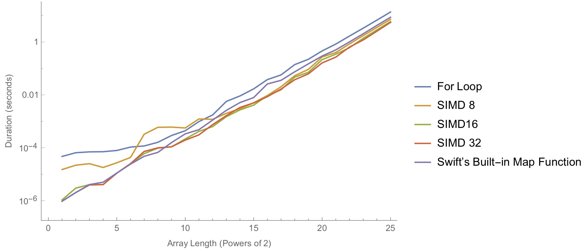

# Data Structures for Swift
This project aims to provide a variety of enhancements (both features and performance) to the existing data structures in Swift. Thep purpose of these improvements is to let Swift become more powerful in computations.

### Array Operations
This category of improvements are extensions to the existing Swift arrays. Many of these are inspired by the NumPy library for python.

- Scalar multiplication

  ```swift
    /* Floating point types */
    // Scalar arithmetics with vectors
    let A: [Double] = [0.3, -2.5, 4.0, 1.2] // Create a Double array
    print(A * 2, A + 2) // [0.6, -5.0, 8.0, 2.4] [2.3, -0.5, 6.0, 3.2]
    print(A / 2, A - 2) // A / 2 = [0.15, -1.25, 2.0, 0.6] [-1.7, -4.5, 2.0, -0.8]
    print(A.sum, A.mean) // 3.0 0.75
    print(A.variance, A.std) // 5.3825 2.32001...
    print(A.abs, A.sqrt) // [0.3, 2.5, 4.0, 1.2] [0.5477..., -nan, 2.0, 1.0954...]
    
    // Vector arithmetics
    
    
    // Comparisons
    print(A <= 1.2, A == 4.0) // [true, true, false, true] [false, false, true, false]
    
    // Note: Unaligned vector comparisons are supported. They will be aligned from index 0, and the unaligned portion will always return 0.0.
    print(A > [0.5, 0.5, 0.8]) // [false, false, true, false]
    
    /* Integer types */
    let I: [Int] = [-3, 5, 9, -2, 17] // Create an Int array
    print(I * 2, I + 2) // [-6, 10, 18, -4, 34] [-1, 7, 11, 0, 19]
    print(I / 2, I - 2) // [-1, 2, 4, -1, 8], [-5, 3, 7, -4, 15]
    print(I << 2, I >> 2) // [-12, 20, 36, -8, 68] [-1, 1, 2, -1, 4]
    
    // Int comparisons are essentially the same as floating point comparisons.
  ```

By using SIMD vector operations and thread-level parallism, my 2-core computer was able to get a roughly 2x speedup from Swift's native map function for this particular operation. Here is a performance comparison: <br />
  
  
  
  
  Eventually I chose to use vectors of size 32 because it yields the best asymptotic performance from my experiments. I also used this vector size for the other array operations.

### Numeric Data structures
- Complex numbers (`Complex`)
